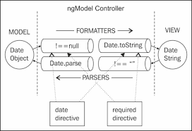

# 表单(form)

####表单元素
* 基于文本的输入: text, textarea, e-mail, URL, number
* 其他: checkbox, radio, select(ng-options)

####ngModelController

ngModelController负责管理存储在模型(ngModel)中的值与Input元素显示值之间的数据绑定。

####model和view之间的值转换

