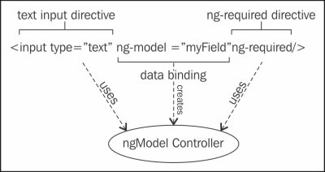
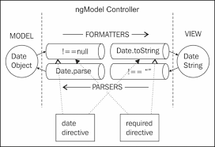

# 表单(form)

####表单元素 
* 基于文本的输入: text, textarea, e-mail, URL, number
* 其他: checkbox, radio, select(ng-options)

####ngModelController

ngModelController负责管理存储在模型(ngModel)中的值与Input元素显示值之间的数据绑定。

####model和view之间的值转换

####表单验证
每一个form指令都会创建一个**ngFormController**的实例。

ngFormController对象管理表单的valid/invalid/pristine/dirty...状态，并与ngModelController协同工作跟踪表单中的每个ngModel字段。

| Property | Class | Description |
| -- | -- | -- |
| $valid | ng-valid | ***Boolean*** Tells whether an item is currently valid based on the rules you placed. |
| $invalid | ng-invalid | ***Boolean*** Tells whether an item is currently invalid based on the rules you placed.|
| $pristine | ng-pristine | ***Boolean*** True if the form/input has not been used yet. |
| $dirty | ng-dirty | ***Boolean*** True if the form/input has been used. |
| $touched | ng-touched | ***Boolean** True if the input has been blurred. |

* validation rule有：required, ng-pattern, min, max, minLength, maxLength
* validation css style有：

    {
        .ng-valid { }
        .ng-invalid{}
        .ng-pristine{}
        .ng-dirty{}
        .ng-touched{}
        .ng-invalid-required{}
        .ng-invalid-minlength{}
        .ng-valid-max-length{} 
    }

