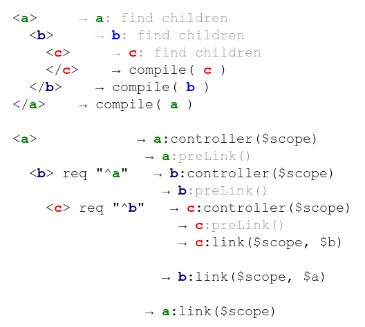

# 指令的生命周期

指令从开始解析道生效，会经历如下阶段：

```Inject```->```compile```->```controller```->```pre-link```->```post-link``` 


####controller
* 创建scope
* 不涉及与DOM有关的信息，只包含业务逻辑代码
* 可以被同一节点或子节点上的directive通过设置require来获取到。

  比如，创建一个给model parse的指令，设置require:'ngModel'，那么引用的就是当前节点上的ngModelController。
  
####post-link
如果在指令中返回一个函数，或者link属性为一个函数，那么默认是post-link函数。


