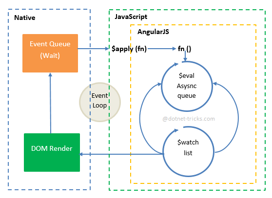

# 脏检查机制

Angular将双向绑定转换为一堆watch表达式，然后递归检查这些watch表达式的结果是否变化。如果变化，则执行相应的watcher函数。等到model值不再变化，也就不会再有watch函数被触发，则一个digest循环结束。

* $watch: 监听scope model变化
* $apply: 触发“脏检查”
* $digest: 内部函数，执行脏检查。
   digest循环包括2个while循环: 
   * 处理$evalAsync的异步运算队列
   * 处理$watch的wathers队列

#####$evalAsync

After a watcher is registered with the scope, the listener fn is called asynchronously (via $evalAsync) to initialize the watcher.
异步执行，它会将表达式缓存起来

